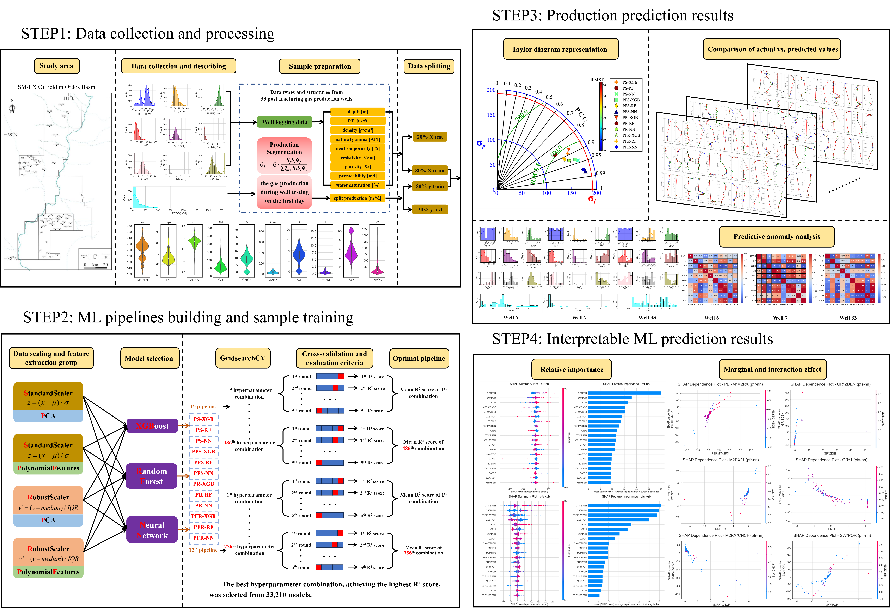

# Leveraging Pipelines and SHAP for Interpretable Machine Learning in Petroleum Production Forecasting

<p align="center">
  
</p>

<p align="center">
  <strong>Interpretable machine learning for post-stimulation production segmentation from well-log data.</strong>
</p>

<p align="center">
  <code>Well logs</code> -> <code>Depth-segmented production</code> -> <code>Optimized pipelines</code> -> <code>SHAP interpretation</code>
</p>

---

## Overview

**PostStim-ProdSeg-ML** is a reproducible Notebook workflow accompanying the EAGE 2025 study *Post-Stimulation Production Segmentation Prediction from Well-log Data: Leveraging Pipelines and SHAP for Interpretable Machine Learning Framework*.

The project predicts post-stimulation production at depth-segment scale from well-log and reservoir attributes. It combines physically motivated production segmentation with systematic preprocessing, model selection, hyperparameter optimization, blind-well evaluation, and SHAP-based interpretation.

| Study design | Model search | Best reported pipeline |
| --- | --- | --- |
| 33 wells and 2,800 depth-segment samples | 12 preprocessing-model pipelines and 33,210 tuned configurations | PFS-NN: R2 = 0.96, PCC = 0.979, RMSE = 39.57 m3/d |

## Workflow

1. **Production segmentation** distributes interval production to depth samples using permeability, saturation, and porosity.
2. **Feature assembly** uses nine well-log and petrophysical features: `DEPTH`, `DT`, `ZDEN`, `GR`, `CNCF`, `M2RX`, `POR`, `PERM`, and `SW`.
3. **Pipeline construction** combines scaling and feature extraction with XGBoost, Random Forest, and Neural Network regressors.
4. **GridSearchCV optimization** performs five-fold cross-validation and selects configurations by R2.
5. **Blind-well evaluation** compares predicted and observed production through R2, MAE, MSE, RMSE, Pearson correlation, and Taylor diagrams.
6. **SHAP analysis** ranks first-order and polynomial interaction features to connect predictions to reservoir interpretation.

## Repository layout

```text
assets/       Workflow figure and EAGE 2025 poster
data/raw/     Data contract only; field data are not distributed
notebooks/    Cleaned, output-free training and interpretation Notebook
docs/         Publication-aligned method and result notes
```

## Quick start

```bash
python -m venv .venv
.venv\Scripts\activate
pip install -r requirements.txt
jupyter lab notebooks/production_segmentation_ml.ipynb
```

Place the authorized dataset at `data/raw/Data_all_forblindtest.xlsx`. See [data/raw/README.md](data/raw/README.md) for the expected columns.

## Publication-aligned results

The EAGE abstract reports that neural-network pipelines outperformed the tested XGBoost and Random Forest alternatives. The best configuration, **PFS-NN**, combined standard scaling, polynomial features, and a neural network. Its reported test metrics were:

| PCC | RMSE (m3/d) | R2 | MAE (m3/d) |
| ---: | ---: | ---: | ---: |
| 0.979 | 39.57 | 0.96 | 9.03 |

SHAP interpretation highlighted saturation-porosity interactions and gamma-ray-related features as important contributors. See [docs/EAGE2025.md](docs/EAGE2025.md) for the research summary.

## Released data and trained models

The original training dataset is available at `data/raw/Data_all_forblindtest.xlsx`. The 12 optimized model pipelines, their explanations, and model-comparison figures are available in `models/`. See [models/README.md](models/README.md) for pipeline naming and safe model-loading guidance.

## Citation and license

Please cite the EAGE 2025 abstract listed in [docs/EAGE2025.md](docs/EAGE2025.md). No reuse license has been selected for this repository yet.
